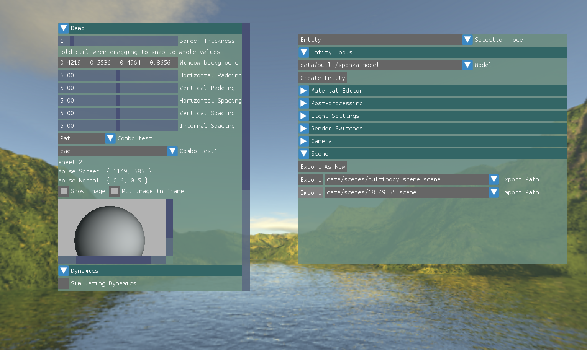

ngpe - None General Purpose Engine
======
A game engine developed bottom up with the goal of learning as much as possible about game engine architecture and the intricacies of large real-time software systems. The title serves as a reminder to not overgeneralize when programming (helps remember to not solve nonexistent problems and avoid "futureproofing"). Developed by Lukas Taparauskas (Dredhog) and Rytis Pranckūnas (QuickShift). Repo began as a university project at KTU and has been continued afterwards.

Features
--------
- Rigid body dynamics system (Gauss Seidel constraint solver with convex polyhedral collision detection)
- Custom IMGUI inspired UI
- Renderer (Supports multiple shaders and multiple materials per entity)
- Skeletal animation system with muli animation playback and blending per entity
- Multiple bones per vertex
- Linear and aditive animation blenging 
- In engine skeletal animation creation and editing (Currently UI for this is missing due to UI system revamp)
- In engine material creation/preview/editing
- Asset build system (Models and actors are built into engine format offline from DCC formats importable by Assimp)
- Resource manager (Runtime resource manager tracks references via resource ids for automatic memory managemen of asset memory)
- Scene import/export
- Vector/Matrix/Quaternion math library
- File IO/File Tree search libraries
- Custom heap and stack memory allocators
- Linux/Windows support
- All higher level subsystems reside in platform independent layer
- Debug drawing facilities

Tools
-----
* Language/Coding Style
	We use c++, howerver most parts of the codebase resemble c, as code is mostry written in a procedural style. We only utilize a few c++ features, such as namespaces, small templates for containers, operator overloading for vectors and anything that is worth the overhead and friction. We try to avoid unnecessary abstraction and premature code compression into functions (only if used in multiple places) as recommended by people such as John Carmack and Casey Muratori. The codebase follows the Insomniac Games' [core-coding-standard](https://gist.github.com/Kerollmops/fcad27cfef9e3552cb75a3d201494ba6 "github page for Insomniac Games' core coding standard.") with the exception that all variable names are in PascalCase;
* Libraries
  * SDL - Resides in platform dependent layer, easily replacable by fully custom platform library
  * OpenGL - Currently using opengl version 3.3
  * Assimp - used only in offline build system for .obj and .dae file parsing

### GUI ###

### In Engine Material Editing ###

### Rigid Body Dynamics and Debug Drawing ###

